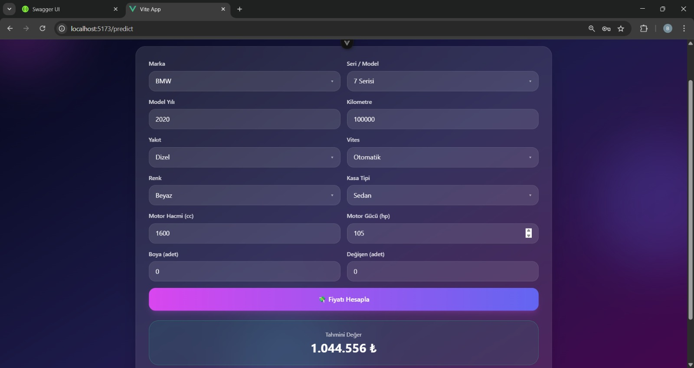

# 🚗 Used Car Price Prediction System

This project is a **Used Car Price Prediction Web Application** developed to estimate second-hand vehicle prices using machine learning models with high accuracy.

The system follows a **Service-Oriented Architecture (SOA)** and integrates a web-based user interface with multiple backend services.

---

## 📌 Project Overview

- Predicts used car prices based on vehicle features
- Uses machine learning regression models
- Clean and well-structured SOA-based backend
- User-friendly web interface

---

## 🧠 Machine Learning Models

The following models were trained and evaluated:

- 🌲 Random Forest Regressor  
- 🚀 Gradient Boosting Regressor  

### Dataset
- Approximately **2500 real-world vehicle records**
- Extensive **data cleaning and preprocessing**
- Feature selection and normalization applied

### Performance
- **Maximum R² Score: 0.94**
- Indicates high prediction accuracy and strong model performance

---

## 🏗️ System Architecture

The project is designed using **Service-Oriented Architecture (SOA)**:

- **Frontend:**  
  - HTML  
  - CSS  

- **Backend Services:**  
  - ASP.NET  
  - Node.js  

- **ML Model Layer:**  
  - Python-based machine learning models  
  - Modular structure for scalability

---

## ✨ Features

- 🔐 User Login Screen
- 💰 Car Price Prediction Interface
- 📊 Real-time prediction results
- 🧩 Modular backend services

---

## 📸 Screenshots

### Login Screen


### Price Prediction Screen


### Past Predictions Screen

P
### Control Panel Screen


---

## ⚙️ Installation & Setup

```bash
git clone https://github.com/Sude2012/used-car-price-prediction.git
cd used-car-price-prediction
